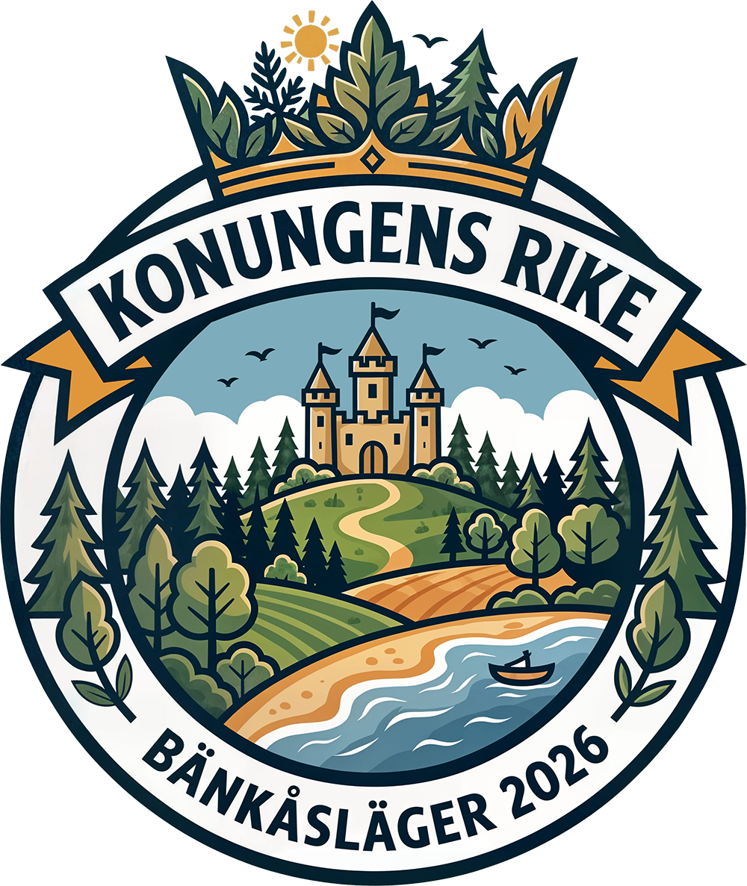

<p align="center">
  
</p>

# Bänkås 2026 — Konungens Rike

Website for a children's summer camp in northern Sweden, organized by Baptistkyrkan Sundsvall & Bilda. The site is styled as a five-page storybook: each page features an illustrated scene, camp information in Swedish, and a hidden mini-game.

See `PROJECT_OUTLINE.md` for the full design.

<p align="center">
  
</p>

## Stack

React 19, TypeScript 6, Vite 8, Tailwind CSS v4, Biome. Hosted on GitHub Pages.

## Getting started

```sh
pnpm install
pnpm dev        # starts on http://localhost:3000
```

## Scripts

| Script          | What it does                                   |
| --------------- | ---------------------------------------------- |
| `pnpm dev`      | Start the dev server (port 3000)               |
| `pnpm build`    | Type-check (`tsc -b`) then build for production|
| `pnpm preview`  | Preview the production build locally           |
| `pnpm lint`     | Run Biome checks (warnings are errors)         |
| `pnpm lint:fix` | Auto-fix lint and format issues                |
| `pnpm format`   | Format all files with Biome                    |

## Styling

All styles are managed through Tailwind CSS v4. Theme tokens (colors, fonts) live in `src/index.css` inside a `@theme` block. There is no `tailwind.config.js`.

The color palette is Rose Pine Dawn with two extra project colors (`earth`, `edge-light`). Use semantic token names (`bg-base`, `text-pine`), not raw hex values.

Two fonts are loaded via `@fontsource-variable`:

- **Nunito** (`font-body`) — body text
- **Playwrite Ireland** (`font-display`) — headings and decorative text; also used for `<em>` and `<i>` in place of italic Nunito

## Change tracking

Changes are planned and tracked with OpenSpec in `openspec/`. Use the `/opsx-*` commands to propose, implement, and archive changes.
